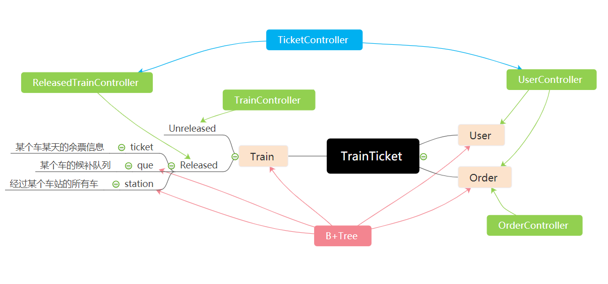

# 开发文档

## 模块划分

## 类

### User类(User.hpp/.cpp)

| 函数名 |   描述   | 函数类型 | 备注 |
| :----: | :------: | :----: | :-----: |
|  User  | 构造函数 |   -   |      |
| ~User  | 析构函数 |   -   |      |

### UserController类(UserController.hpp/.cpp)

| 函数名 |   描述   | 函数类型 | 备注 |
| :----: | :------: | :----: | :-----: |
|  add_user  | 添加用户 |   void   | |
| login  | 用户登录 |   void   | |
| logout | 用户登出 | void | |
| query_profile | 查询用户信息 | void | |
| modify_profile | 修改用户信息 | void | |
| query_order | 查询订单信息 | void | |
| modify_order | 修改订单信息 | void | 不判断传入数据合法性 |
| get_order | 获取订单信息 | Order | 不判断传入数据合法性 |
| print_profile | 打印用户信息 | void | 不判断传入数据合法性 |
| print_order | 打印订单信息 | void | 不判断传入数据合法性 |
| add_order | 添加订单 | void | 不判断传入数据合法性 |
| load | 读档 | void |  |
| save | 存档 | void |  |

### Train类(Train.hpp/.cpp)

`Released Train`和`Unreleased Train`都用此Train类

对于`Travel Times`和`Stopover Times`存前缀和

| 函数名 |   描述   | 函数类型 | 备注 |
| :----: | :------: | :----: | :-----: |
|  Train  | 构造函数 |   -   |      |
| ~Train  | 析构函数 |   -   |      |

### TrainController类(TrainController.hpp/.cpp)

| 函数名 |   描述   | 函数类型 | 备注 |
| :----: | :------: | :----: | :-----: |
|  add_train  | 添加未发布车次 |   void   | |
| delete_train  | 删除未发布车次 |   void   | |
| load | 读档 | void |  |
| save | 存档 | void |  |

### Order类(Order.hpp/.cpp)

| 函数名 |   描述   | 函数类型 | 备注 |
| :----: | :------: | :----: | :-----: |
|  Order  | 构造函数 |   -   |      |
| ~Order  | 析构函数 |   -   |      |

### OrderController类(OrderController.hpp/.cpp)

| 函数名 |   描述   | 函数类型 | 备注 |
| :----: | :------: | :----: | :-----: |
| load | 读档 | void |  |
| save | 存档 | void |  |

### ReleasedTrainController类(ReleasedTrainController.hpp/.cpp)

用于操作已发布车次的余票信息、候补队列

为方便字符串在文件中的读写，内含Char类
Char类有构造函数和用于复制到char数组的copy函数

| 函数名 |   描述   | 函数类型 | 备注 |
| :----: | :------: | :----: | :-----: |
| release_train | 发布车次 | void |  |
| query_train | 查询车次信息 | void |  |
| modify_ticket | 修改余票信息 | void | 不判断传入数据合法性 |
| query_ticket | 查询余票信息 | void | 不判断传入数据合法性 |
| add_order | 添加订单进候补队列 | void | 不判断传入数据合法性 |
| delete_order | 删除候补队列的订单 | void | 不判断传入数据合法性 |
| adjust_order | 调整候补队列，某些候补订单购票 | void | 不判断传入数据合法性 |
| load | 读档 | void |  |
| save | 存档 | void |  |

### TicketController类(TicketController.hpp/.cpp)

三方交互，涉及火车、订单、用户等

为方便字符串在文件中的读写，内含Char类
Char类有构造函数和用于复制到char数组的copy函数以及`<`,`==`的重载(用于排序)

| 函数名 |   描述   | 函数类型 | 备注 |
| :----: | :------: | :----: | :-----: |
| query_pass | 查询经过某个车站的所有车次 | int(车次个数) | 不判断传入数据合法性 |
| get_all | 计算某个车次到from和to的时间和票价 | int(票价) | 不判断传入数据合法性 |
| query_ticket | 修改车票 | void |  |
| query_transfer | 查询换乘车票 | void |  |
| buy_ticket | 买票 | void |  |
| refund_ticket | 退票 | void |  |
| load | 读档 | void |  |
| save | 存档 | void |  |

### Interface类(Interface.hpp/.cpp)

最顶端的接口，用于处理用户输入的字符串，转发给各个对象

| 函数名 |   描述   | 函数类型 | 备注 |
| :----: | :------: | :----: | :-----: |
| start | 初始化程序 | void |  |
| run | 开始运行程序，只在main函数调用一次 | void |  |
| exit | 同作业要求 | void |  |
| create_file | 创建所需文件 | void |  |
| add_user | 同作业要求，处理字符串，把指令转发给UserController | void |  |
| login | 同作业要求，处理字符串 | void |  |
| logout | 同作业要求，处理字符串 | void |  |
| query_profile | 同作业要求，处理字符串 | void |  |
| modify_profile | 同作业要求，处理字符串 | void |  |
| add_train | 同作业要求，处理字符串 | void |  |
| release_train | 同作业要求，处理字符串 | void |  |
| query_train | 同作业要求，处理字符串 | void |  |
| delete_train | 同作业要求，处理字符串 | void |  |
| query_ticket | 同作业要求，处理字符串 | void |  |
| query_transfer | 同作业要求，处理字符串 | void |  |
| buy_ticket | 同作业要求，处理字符串 | void |  |
| query_order | 同作业要求，处理字符串 | void |  |
| refund_ticket | 同作业要求，处理字符串 | void |  |
| clean | 同作业要求，处理字符串 | void |  |
| split | 把字符串按照分隔符分成若干部分 | int(划分出的部分数量) |  |
| read_num | 从字符串中读取一个int | int |  |
| read_time | 从字符串中读取Time | Time |  |
| read_date | 从字符串中读取Date | Date |  |

### BTree类(BTree.hpp/.cpp)

B+树模板类，作用相当于map，节点的大小默认为4096byte
所操作的文件不保存在类内部，每次作为参数传给B+树
启用缓存

| 函数名 |   描述   | 函数类型 | 备注 |
| :----: | :------: | :----: | :-----: |
| insert | 插入或修改一个元素，若已存在则为修改 | void |  |
| remove | 删除一个元素，若没有则什么都不做 | void |  |
| modify | 同insert | void |  |
| query_list | 查询Key在[key_left,key_right]之间的所有pair<Key,Value> | int |  |
| query | 查询Key对应的Value | Value |  |
| exist | 查询Key是否存在 | bool |  |
| write_cache | 将缓存写入文件 | void |  |
| insert_leaf | insert的辅助函数，用于对叶子节点insert | tuple | 根据返回值判断是否分裂 |
| insert_node | insert的辅助函数，对中间节点insert | tuple | 根据返回值判断是否分裂 |
| get_min_leaf | 获取叶子中最小的Key | Key |  |
| get_min_node | 获取中间节点中最小的Key | Key |  |
| remove_leaf | remove的辅助函数，对叶子进行remove | bool | 根据返回值判断是否需要合并 |
| remove_node | remove的辅助函数，对中间节点remove | bool | 根据返回值判断是否需要合并 |
| query_leaf_pos | query_list的辅助函数，查询Key所在的叶子的地址 | int(地址) |  |
| query_leaf_pos_helper | query_list的辅助函数，查询Key所在的叶子的地址 | int(地址) |  |
| query_leaf | query的辅助函数 | Value |  |
| query_node | query的辅助函数 | Value |  |
| exist_leaf | exist的辅助函数 | bool |  |
| exist_node | exist的辅助函数 | bool |  |
| between | 等同于operator==，用operator<来实现 | bool |  |

### FileOperator类(FileOperator.hpp/.cpp)

FileOperator类有三个部分

#### FileOperator类

将二进制文件读写进行简单封装

| 函数名 |   描述   | 函数类型 | 备注 |
| :----: | :------: | :----: | :-----: |
| create_file | 若文件不存在，则创建该文件 | bool(文件是否存在) |  |
| create_new_file | 清空该文件 | void |  |
| read | 函数模板，从文件的pos位置读取cnt个T类型的对象 | void |  |
| write | 函数模板，将cnt个T类型的对象写入到文件的pos位置 | int(写入起始位置) | pos为-1时，写入到末尾 |
| end_pos | 获取该文件的末尾位置，即文件大小 | int |  |

#### LRU类

文件缓存的核心内容
文件的一个缓存单元用三个变量描述，封装在Node类中
info.first是这块内容的起始位置
info.second是这块内容的大小
value是这块内容在内存中的缓存，类型为char*
前提条件为，文件中不采用垃圾回收机制：文件中pos位置开始的sz个字节永远只存储同一个对象，即使该对象被弃用也不回收
LRU实现方法：使用一个哈希表用于快速索引到缓存单元，使用一个链表维护“最近访问”序列

| 函数名 |   描述   | 函数类型 | 备注 |
| :----: | :------: | :----: | :-----: |
| is_prime | 判断质数 | bool | 哈希用辅助函数 |
| eq | 判断两个缓存单元是否相等 | bool | 若pos相等，强制assert其sz相等 |
| query_pt | 查询该缓存单元在哈希表中的位置 | int |  |
| query | 查询该缓存单元，同时置为最近访问 | Node* |  |
| insert | 将一个缓存单元插入LRU，要求保证其之前不存在 | Node*(新插入的缓存单元) |  |
| remove | 移除该缓存单元 | void |  |
| hsh | 对缓存单元进行哈希 | int |  |
| adv | 若二次探测冲突，取下一个哈希值 | int |  |
| read | 同FileOperator，且将这块内容加入LRU | void |  |
| write | 同FileOperator，且将这块内容加入LRU | void |  |
| write_cache | 将LRU所有内容写入文件 | void |  |

#### CachedFileOperator

内置LRU的FileOperator，对LRU进行了封装
可以指定缓存大小

| 函数名 |   描述   | 函数类型 | 备注 |
| :----: | :------: | :----: | :-----: |
| read | 同FileOperator，且将这块内容加入LRU | void |  |
| write | 同FileOperator，且将这块内容加入LRU | int(写入位置) | 若写入到末尾，则不进行缓存 |
| write_cache | 将LRU所有内容写入文件 | void |  |

### Hash类(Hash.hpp/.cpp)

对字符串进行哈希

| 函数名 |   描述   | 函数类型 | 备注 |
| :----: | :------: | :----: | :-----: |
| hash | 哈希函数 | pair<int,int> | 使用双哈希 |

### Date类(Date.hpp/.cpp)

用于日期操作
| 函数名 |   描述   | 函数类型 | 备注 |
| :----: | :------: | :----: | :-----: |
| cal_day | 计算某月的最大日期 | int |  |
| Date | 构造函数 | - |  |
| operator+ | 日期增加(多少天) | Date | 只能增加不能减少 |
| operator< | 判断日期大小关系 | bool |  |
| operator- | 计算两个日期的差值 | int(天数) |  |
| operator<< | 输出 | ostream& |  |
| operator>> | 读入 | istream& | 仅在调试中用到 |
| exist | 判断日期是否合法 | bool |  |

### Time类(Date.hpp/.cpp)

用于时间操作(包含日期、小时、分钟)
| 函数名 |   描述   | 函数类型 | 备注 |
| :----: | :------: | :----: | :-----: |
| Time | 构造函数 | - |  |
| operator+ | 时间增加(多少分钟) | Time | 只能增加不能减少 |
| operator< | 判断时间大小关系 | bool |  |
| operator- | 计算两个时间的差值 | int(分钟) |  |
| operator<< | 输出 | ostream& |  |
| operator>> | 读入 | istream& | 仅在调试中用到 |
| exist | 判断时间是否合法 | bool |  |

## 文件

| 编号 |         **文件名**         |         描述         |                 B+树中的Key和Value类型                 |
| :--: | :------------------------: | :------------------: | :----------------------------------------------------: |
|  1   |       **user_btree**       |    用户信息B+Tree    |                pair<int,int>  User                |
|  2   |       **user_info**        |       用户信息       |                                                        |
|  3   |      **order_btree**       |    订单信息B+Tree    |           pair<pair<int,int>,int> Order           |
|  4   |       **order_info**       |       订单信息       |                                                        |
|  5   |       **que_btree**        |    候补队列B+Tree    |   tuple<pair<int,int>,Date,int> pair<Char,int>    |
|  6   |        **que_info**        |     候补队列信息     |                                                        |
|  7   | **train_info_unreleased ** |    未发布车次信息    |                                                        |
|  8   |  **train_id_unreleased **  |   未发布车次B+Tree   |               pair<int,int>  Train                |
|  9   |  **train_info_released **  |     发布车次信息     |                                                        |
|  10  |   **train_id_released **   |    发布车次B+Tree    |               pair<int,int>  Train                |
|  11  |      **ticket_info**       |       余票信息       |                                                        |
|  12  |     **station_btree**      | 经过车站的车次B+Tree | pair<pair<int,int>,pair<int,int> > pair<Char,int> |
|  13  |      **station_info**      |    经过车站的车次    |                                                        |
|  14  |         **counts**         | 用户、订单、车次个数 |                                                        |

## 分工

| 组员 |   后端   | 前端 | 其它 |
| :----: | :------: | :----: | :----: |
| 孟良谕 | B+Tree Interface FileOperator(缓存) Hash 指导后端调试、卡常(写缓存) | server client中连接服务器 及收发信息相关函数 | 模块功能设计 教组员写代码/调试/前端等 开发文档(部分) |
| 石昕怡 | ReleasedTrainController TicketController Date及Time 后端编译、调试、卡常 | 无 | 开发文档(部分) |
| 潘新怡 | User及UserController Train及TrainController Order及OrderController | client其余部分及界面设计 | 小组讨论记录工作 使用手册 |

更新时间：2020/06/25 17:17