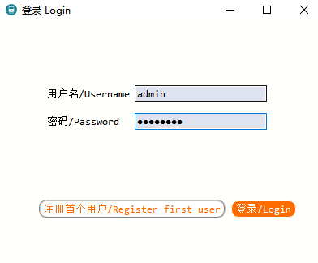
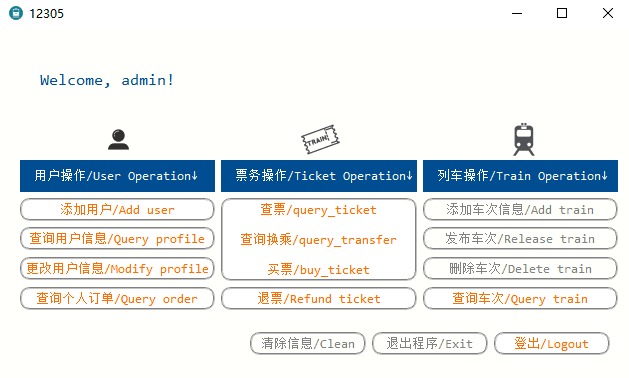

# 用户手册

### 如何获取

将`Release.zip`解压缩在任意目录下即可。

### 如何使用

首先请确定`Server`已运行。

#### 对于用户

1. 在Release版本中双击`src_client.exe`，可以看到**登入服务器界面**。

2. 使用`Server`的IP地址连接服务器。如`Server`运行在本机，使用本机地址`127.0.0.1`。连接成功可进入**登陆界面**。

3. 使用用户名及密码登陆，进入**主界面**。

4. 在主界面，用户可单击**橙色按钮**，进行如下操作：

- 用户操作
  - 添加用户
  - 查询用户信息
  - 更改用户信息
  - 查询个人订单
- 票务操作
  - 查票/查询换乘/购票
  - 退票
- 车次操作
  - 查询车次
- 其他
  - 登出

5. 单击按钮并按照提示信息输入信息即可完成对应操作。
6. 成功登出后所有窗口均会关闭，如需再次使用请重新打开程序。

【注意】用户登陆成功后如需退出，请务必单击`登出`。请勿手动关闭窗口，这可能会导致该用户下次无法登录。如果出现该情况，请联系服务提供方。

【注意】灰色按钮也可点击，但请不要这样做。

#### 对于管理员/开发者

1. 在Release版本中双击`src_client.exe`，可以看到**连接服务器界面**。可勾选`开发者模式`，则每次向后端发送的信息会以弹窗形式显示。

2. 使用`Server`的IP地址连接服务器。如`Server`运行在本机，使用本机地址`127.0.0.1`。连接成功可进入**登陆界面**。

3. 如为初次使用或信息已被清空，则可选择`注册首个用户`，并填写相关信息。

4. 使用用户名及密码登陆，进入**主界面**。

5. 可单击各个按钮，进行如下操作：

- 用户操作
  - 添加用户
  - 查询用户信息
  - 更改用户信息
  - 查询个人订单
- 票务操作
  - 查票/查询换乘/购票
  - 退票
- 车次操作
  - *添加车次信息
  - *发布车次
  - *删除车次
  - 查询车次
- 其他：
  - *清除信息

    【注意】这会清除所有数据，包括所有的用户信息、车次信息、订单信息等，并无法恢复。请谨慎操作。
  - *退出程序

    【注意】这会让所有用户下线，关闭`Server`与本程序。请谨慎操作。
  - 登出

6. 单击按钮并按照提示信息输入信息即可完成对应操作。
7. 成功登出后所有窗口均会关闭，如需再次使用请重新打开程序。

【注意】用户登陆成功后如需退出，请务必单击`登出`。请勿手动关闭窗口，这可能会导致该用户下次无法登录。如果出现该情况，请联系服务提供方。

更新时间：2020/06/25 23:17